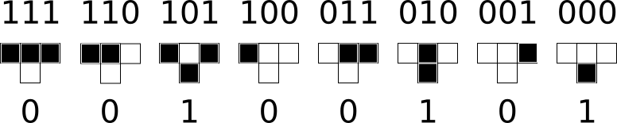
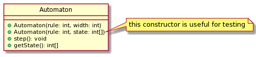

# CSc 22100 Spring 2022 Assigment 2

In this assignment, we'll implement a simulation of 1-dimensional [elementary cellular automata](https://mathworld.wolfram.com/ElementaryCellularAutomaton.html).

From [Mathworld](https://mathworld.wolfram.com/CellularAutomaton.html):

> A cellular automaton is a collection of "colored" cells on a grid of specified shape that evolves through a number of discrete time steps according to a set of rules based on the states of neighboring cells. The rules are then applied iteratively for as many time steps as desired. von Neumann was one of the first people to consider such a model, and incorporated a cellular model into his "universal constructor."

Elementary cellular automata are cellular automata with a single dimension where:
- each cell has only two possible values (on/off, 1/0, black/white)
- the next state of a cell is determined solely by its state together with the states of its left and right neighbors.

There are 8 (2x2x2) possible states for a cell and its two neigbors. To define an elementary cellular automaton, for each of these eight states, we need to decide if the center cell is on or off in the next generation. This means there are 2^8=256 possible rules defining cellular automata.

Each number from 0 to 255 can then be interpreted as a _Wolfram code_ defining a cellular automaton. We start by writing down the eight possible states for a cell and its neighbors (the order matters!). 

| 111 | 110 | 101 | 100 | 011 | 010 | 001 | 000 |

Next, we take our integer and translate it into binary. For example, suppose we want to determine the transition rule for automaton 37. 37 in base 2 is 100101. We pad the base 2 representation with 0s until we have eight digits: 00100101. Then, line up each of these digits under the eight states. This gives us the following transition rules:



(*Implementation hint*: Note that the states are labeled by the binary representations of 7,6,5,...,0. How can you use this 
information to help store the transition rules?)

## Instructions

Write a program that does the following:
- reads three integers from the `args` array (in this order): the rule number, the number of iterations and the width of the automaton to display
- prints the state of a Rule N automaton of the given width for the given number of iterations
  - the starting state of the automaton should have one 'on' cell in the center (if the width is even, start with the cell to the right of the center line turned on)
  - if a cell is on the edge of the array, consider its left/right neighbor always 'off'
  - use X to indicate an 'on' cell and O to indicate an 'off' cell
  - if the number of iterations is 0, you should write the starting state
  
### Requirements/Grading
- Implement the `Automaton` class. The precise details are up to you, but you should implement the methods as described in the UML diagram:



- Implement the `Simulator` class.
- Write at least two (non-trivial!) tests for your `Automaton` class

|---|---|
| Item | Points |
| Javadoc and comments explaining main points | 2 |
| Throws an exception if incorrect or invalid number of arguments | 2 |
| Code readability and style | 2 |
| `Automaton` tests | 2 | 
| Code compiles | 1 |
| Tests pass | 1 |
| Correctness: Hidden test cases | 3 |

### Sample executions

Input: `110 10 20`

Output:

```
OOOOOOOOOOXOOOOOOOOO
OOOOOOOOOXXOOOOOOOOO
OOOOOOOOXXXOOOOOOOOO
OOOOOOOXXOXOOOOOOOOO
OOOOOOXXXXXOOOOOOOOO
OOOOOXXOOOXOOOOOOOOO
OOOOXXXOOXXOOOOOOOOO
OOOXXOXOXXXOOOOOOOOO
OOXXXXXXXOXOOOOOOOOO
OXXOOOOOXXXOOOOOOOOO
```

Input: `110 0 20`

Output:

```
OOOOOOOOOOXOOOOOOOOO
```

## Helpful functions and hints

- `Integer.toBinaryString` converts an int to its binary representation
- `String.format` doesn't let you pad a _string_ with 0s (you can pad an `int`), but you can pad with spaces and then replace: `String.format("%8s", ...).replace(' ', '0')`

## Resources:
- [1D ECA Simulator](https://elife-asu.github.io/wss-modules/modules/1-1d-cellular-automata/) (warning: this site displays the correct transitions, but in a non-standard order)


